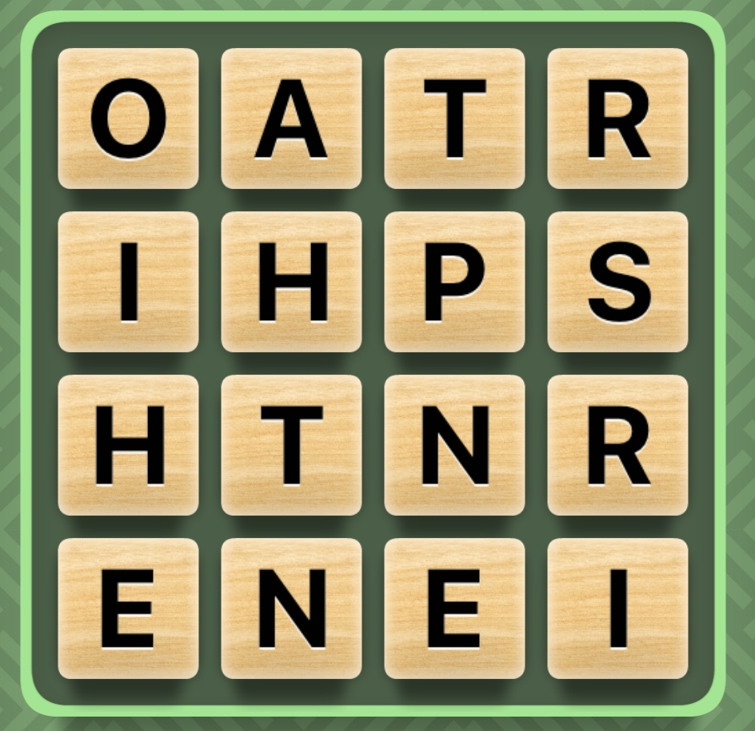

# WordhuntSearch 🔍

WordHuntSearch is a tool that is used to find all the words that is possible from the game pigeon game wordhunt!

## What is wordhunt?

You are given 1-2 minutes with a random 4x4 grid of letters, and you drag to connect the letters to make words, There are also some features / constrants that the user must abide by

(picture of wordhunt grid)

## Game Features & Constraints 🔒

- Words can only be used once
- The longer the word, the more points you recieve
- All words must be 3 letters or longer
- The word must be able to be connected by the grid

## How does WordHuntSearch work?

1. The script initially accepts a string input representing the word square, which it then converts into a 2D list (word_square) for easier manipulation.
It reads a list of valid words from wordlist.txt and stores them in a set (Inital_wordlist) for quick lookups.

### Direction Definitions

A list of tuples named directions defines the possible movements from any letter in the grid: vertically, horizontally, and diagonally adjacent positions.

### Utility Functions

`is_valid_extension(x, y, used):` Checks if a new position is within the grid bounds and not already used in the current word being formed.

`check_valid_words(word_dict):` Filters out valid words from a dictionary that maps letter combinations to their possible continuations and used coordinates.

`remove_duplicates(words_list):` Removes duplicate entries from a list of words.

`get_touching_combinations(x, y):` Generates all valid two-letter combinations starting from a given position.

`delete_words(word_dict):` Removes entries from a dictionary where no valid word continuations exist.

`looped_search_stacked(x, y, combo, word, used):` Recursively searches for longer words starting with a given combination, marking used positions to avoid repetition.
Word Search Initialization:

2. The script generates all valid two-letter combinations from the grid and initializes a dictionary (word_dict) mapping these combinations to their possible word continuations and used coordinates.
Word Extension:

3. Using create_extra_letter_dict(word_dict), the script extends valid two-letter combinations to longer ones by checking adjacent letters and updating the dictionary with new combinations, possible words, and used coordinates.
Valid Word Identification:

4. The script iterates through the extended combinations, filtering out valid words using check_valid_words and storing them in valid_wrds.
Recursive Search for Longer Words:

5. For each four-letter combination, looped_search_stacked is called to recursively search for and add longer valid words to valid_wrds.

### Output and Cleanup:

The list of valid words (valid_wrds) is sorted by length in descending order, duplicates are removed, and the results are written to out.txt.
The script prints the total time taken to execute.

## Tech Stack ✨

- **Backend**: Python, Flask
- **Frontend**: HTMl, CSS, JavaScript

## Usage

TBD

## Contributing

Contributions are welcome! Please feel free to submit a Pull Request.

## Acknowledgments

- Inspired by Tesla's green light notification feature
